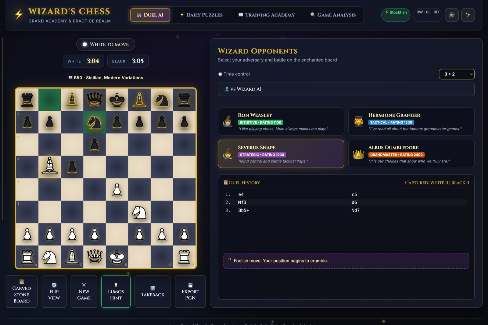
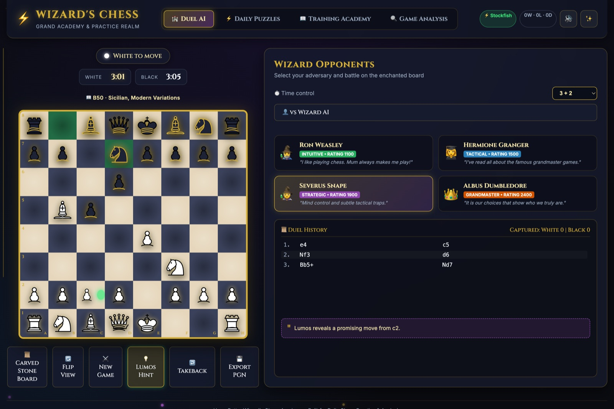
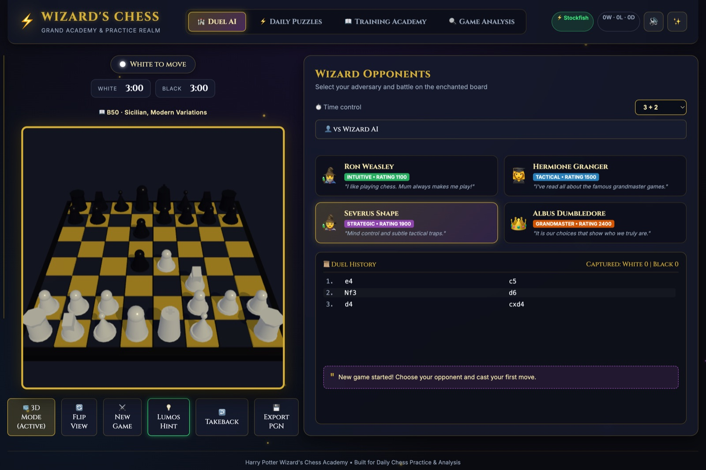
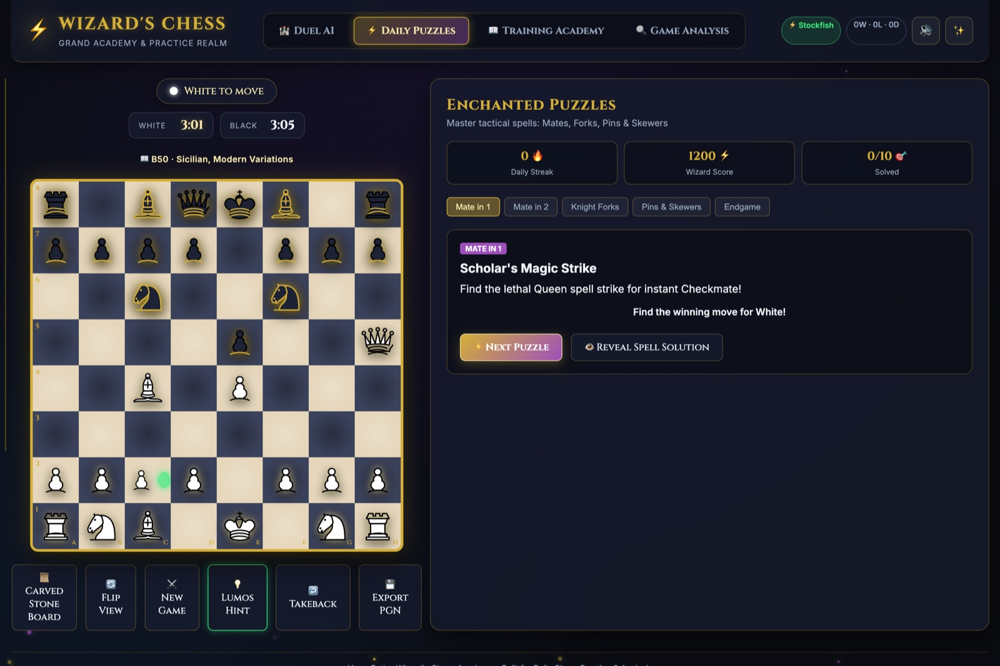
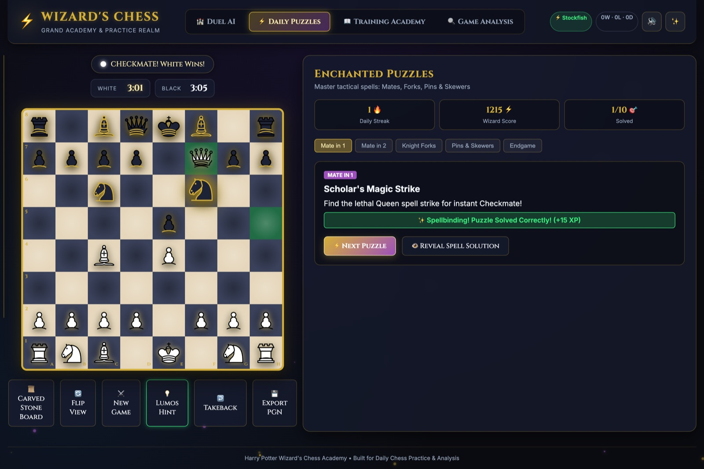
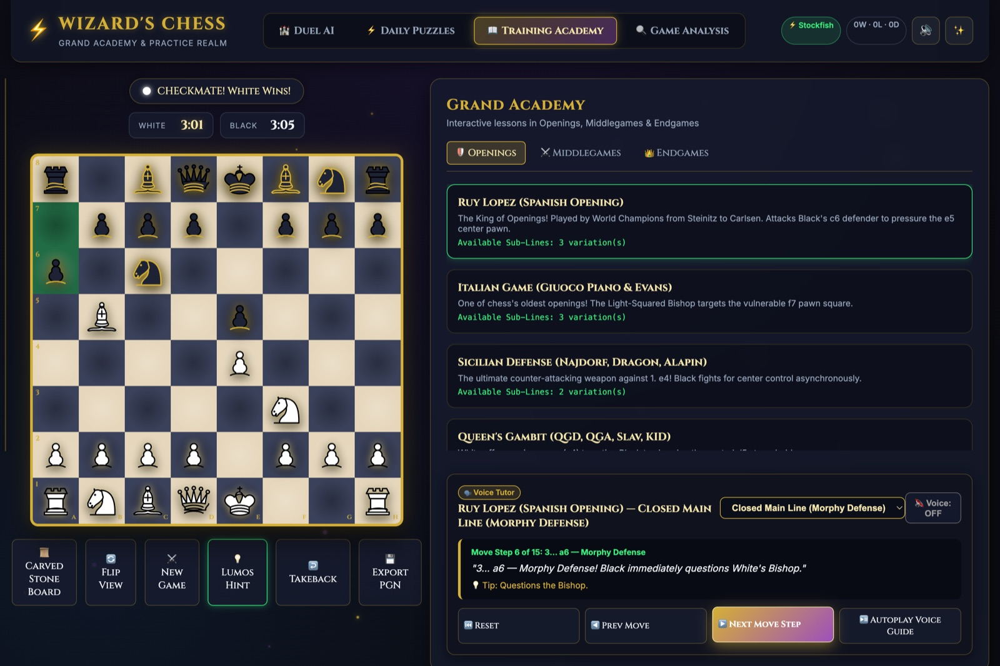
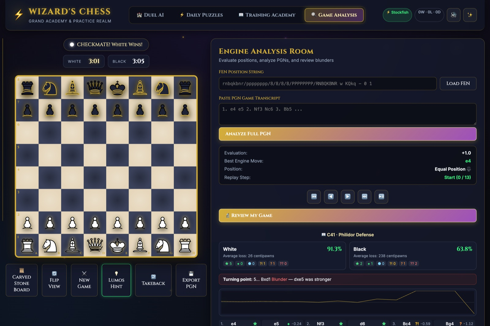
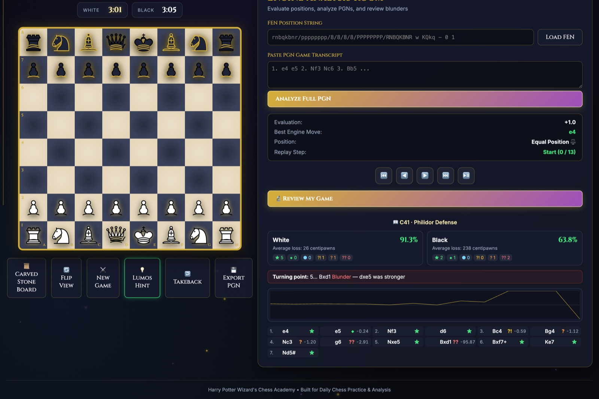

# Wizard's Chess & Learning Academy

A browser chess app with a wizarding-school theme: play against graded engine
opponents, solve tactical puzzles, work through voice-guided opening lessons,
and review your finished games move by move.

Built with [Vite](https://vitejs.dev/), [chess.js](https://github.com/jhlywa/chess.js)
and [three.js](https://threejs.org/). No backend — everything runs in the browser.

---

## Play

Four opponents, each genuinely separated in strength. The engine runs in a Web
Worker, so the board stays responsive no matter how long it thinks.



The bar on the left is a live evaluation. Above the board: the clock (when a
time control is set) and the detected opening with its ECO code.

### Lumos hint

Ask the engine for a nudge and it lights up the piece you should be looking at.



### 3D board

Toggle between the carved-stone 2D board and a three.js 3D view. The 3D code is
loaded lazily — it costs nothing until you switch to it.



---

## Daily Puzzles

Tactical positions grouped by theme: mate in one, mate in two, knight forks,
pins and skewers, and endgames. Every position is verified — the FEN is legal,
the solution is a legal move, and each "mate in 1" has exactly one mating move.



Your streak, score and solved count persist across sessions in `localStorage`.



---

## Training Academy

Opening, middlegame and endgame lessons that play out move by move, with a
written explanation and an optional spoken narration (Web Speech API) for each
step. Openings branch into named sub-variations.



---

## Game Analysis & Review

Load a FEN or PGN, step through any game, or run a full review of the game you
just played.



The review evaluates every position and grades each move by how much it gave
away, then reports per-side accuracy, the distribution of move quality, an
evaluation graph, and the game's turning point. Clicking any move jumps the
board to that position.



Move grades are based on centipawn loss:

| Grade | Loss | | Grade | Loss |
|---|---|---|---|---|
| ★ Best | ≤ 10 | | ?! Inaccuracy | ≤ 100 |
| ◆ Excellent | ≤ 25 | | ? Mistake | ≤ 250 |
| ● Good | ≤ 50 | | ?? Blunder | > 250 |

---

## The engines

There are two, and the app picks the best one available at load time. The badge
in the header tells you which is active.

### Stockfish (primary)

[Stockfish 10](https://github.com/nmrugg/stockfish.js) compiled to WebAssembly,
~430KB, driven over the UCI protocol from a Web Worker. It boots in roughly
230ms and searches at over a million nodes per second.

Stockfish 10 predates the `UCI_LimitStrength` / `UCI_Elo` options, so difficulty
is set with `Skill Level` **and** an explicit depth cap. The cap matters: at this
search speed even a 300ms time budget reaches depth 13, so skill level alone
would leave every opponent near full strength.

| Opponent | Skill Level | Depth | Approx. rating |
|---|---|---|---|
| Ron Weasley | 0 | 1 | ~800 |
| Hermione Granger | 3 | 4 | ~1400 |
| Severus Snape | 12 | 8 | ~1900 |
| Albus Dumbledore | 20 | 14 | ~2600 |

The ordering is verified by head-to-head play: each tier beats the one below it
as both colours.

### Built-in engine (fallback)

A hand-written alpha-beta engine in [`src/engine.js`](src/engine.js), used when
Stockfish cannot load and for the cheap live evaluation bar. It has iterative
deepening on a time budget, a transposition table with bound flags, killer and
history move ordering, null-move pruning, late move reductions, quiescence
search with delta pruning, and a tapered evaluation covering king safety, pawn
structure, passed pawns and the bishop pair.

Its speed comes from bypassing one specific bottleneck: chess.js's public
`moves({ verbose: true })` builds a SAN string for every move, costing ~399µs
per call, while the internal generator costs ~13µs. The search uses the internal
API (probed for at runtime, with the public API as a fallback), which is worth
roughly 33x — depth 8 went from about 60 seconds to 1.8.

---

## Opening recognition

117 ECO-coded lines, plus every line taught in the Academy — adding a lesson
automatically adds recognition for it. The longest matching line wins, so you
get the most specific name available.

For a much larger book, lichess publishes about 3,500 named openings under CC0
at [lichess-org/chess-openings](https://github.com/lichess-org/chess-openings).
Converting its rows to `{ eco, name, moves }` is all that is needed;
`identifyOpening()` requires no changes.

---

## Running it

```bash
npm install
npm run dev
```

Then open <http://localhost:3000>.

```bash
npm run build     # production build into dist/
npm run preview   # serve the production build
```

The Stockfish worker and its `.wasm` live in `public/engine/` and are copied to
`dist/engine/` at build time. They are deliberately left unbundled so the engine
can locate its own WebAssembly file at runtime.

---

## Project layout

| Path | Purpose |
|---|---|
| `src/main.js` | App orchestrator, UI wiring, tab and game state |
| `src/ai.js` | Engine facade — picks Stockfish or the built-in engine |
| `src/stockfish.js` | UCI driver for the Stockfish worker |
| `src/engine.js` | Built-in alpha-beta engine and evaluation |
| `src/review.js` | Post-game move grading and accuracy |
| `src/analysis.js` | FEN/PGN loading and game replay |
| `src/board.js` / `src/board3d.js` | 2D and 3D board rendering |
| `src/puzzles.js` | Puzzle database and progress |
| `src/academy.js` | Lesson content and variations |
| `src/openings.js` | Opening recognition |
| `src/clock.js` | Chess clock with Fischer increment |
| `src/storage.js` | localStorage persistence and PGN export |
| `src/audio.js` / `src/particles.js` | Sound effects and visual effects |

---

## Licensing

This project is MIT licensed (see [LICENSE](LICENSE)).

**Stockfish is GPLv3**, and its licence is included at
`public/engine/stockfish-LICENSE.txt`. Distributing the app together with
Stockfish has implications for the licence of the combined work. It is kept as a
separate, unbundled worker file and the built-in engine is a complete fallback,
so removing it is straightforward if that matters for your use.

Chess piece graphics are the Cburnett Staunton set.
